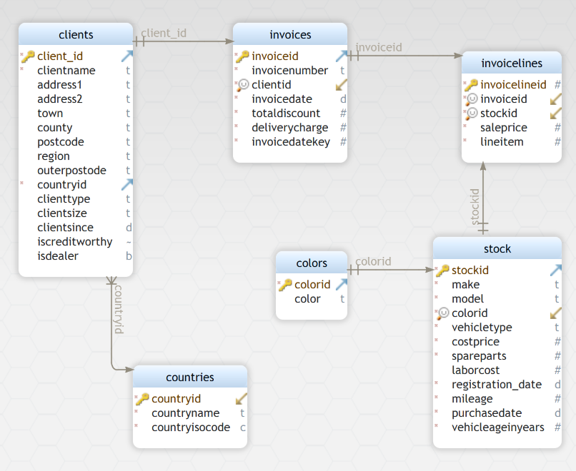
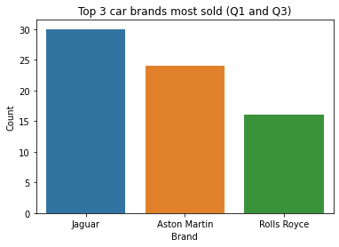
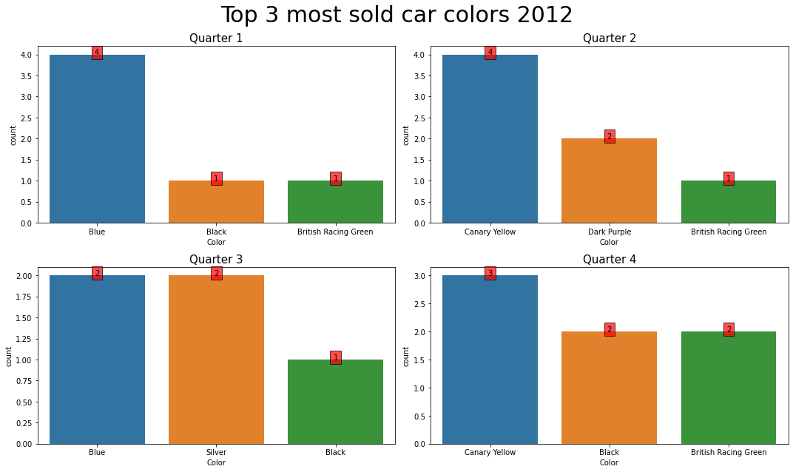
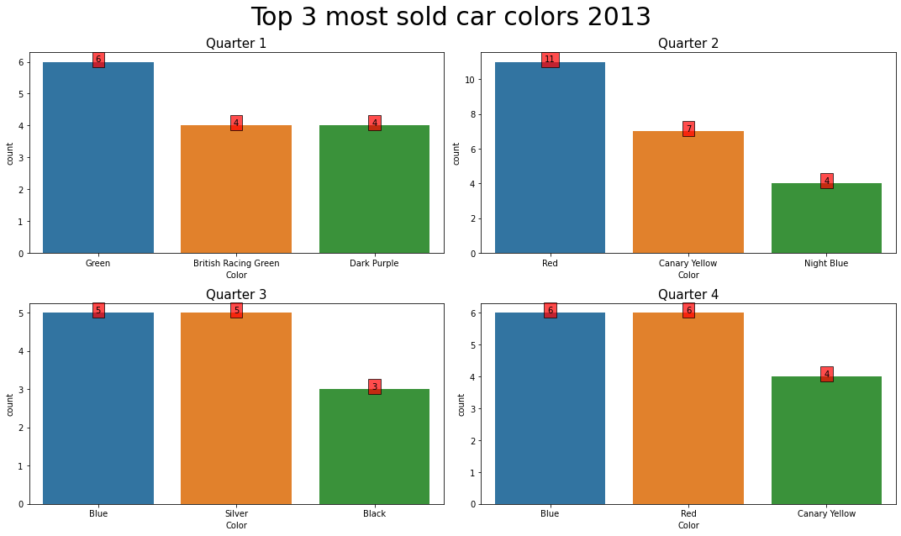
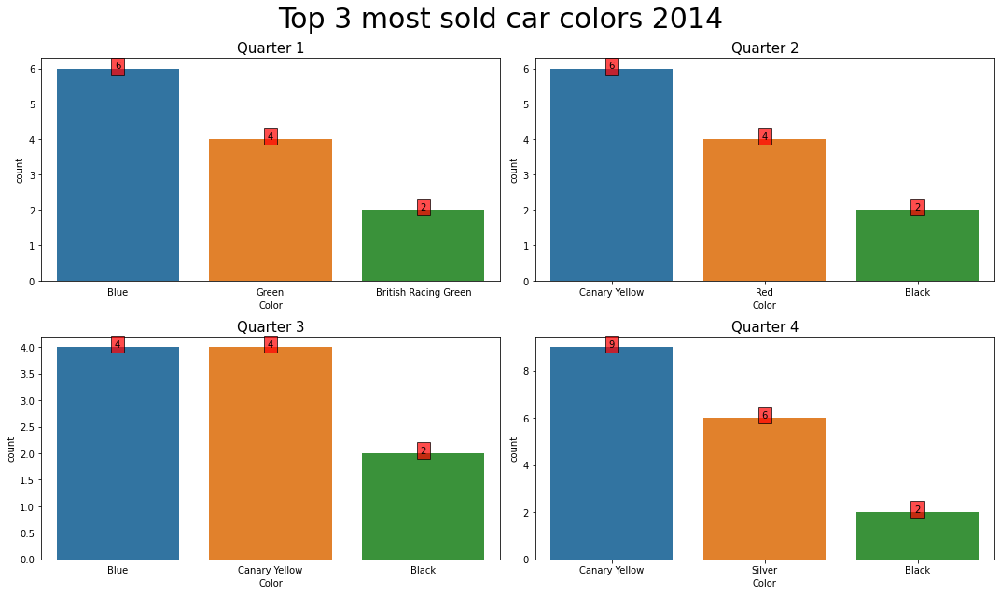
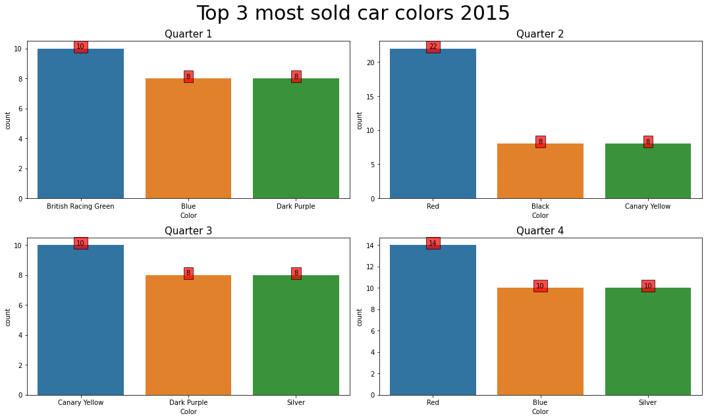

# Cargill Internship Program Evaluation
**Coded by:** Fernando Sirias
___

## Exercise 1 – Data Modeling

1. Create a data model for CarSalesDataforReports Excel spreadsheet

___
## Exercise 2 – Object Oriented Programming

1. Define the required classes, methods and properties based on CarSalesDataforReports Excel file.
2. Based on the point number one, define a class to include another kind of transportation vehicle. Include  properties and methods that you consider required.

**See Notebook to find the solution**
___
# Exercise 3 – Queries
**See Notebook for more detail solution**

1. Create a query that returns the top 3 car brands most sold (i.e., having the most car brand sales) during first  and third quarter of year 2015.

2. Create a query that shows the top 3 most sold car colors (i.e., having the most car color sales) for each  quarter for the years 2012,2013,2014,2015.

